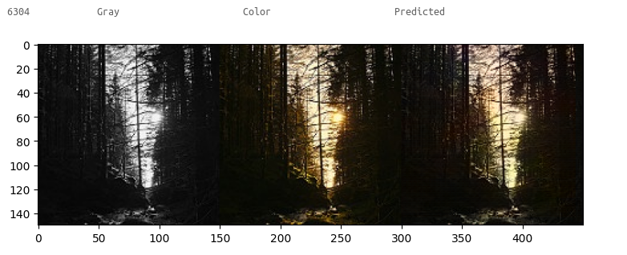
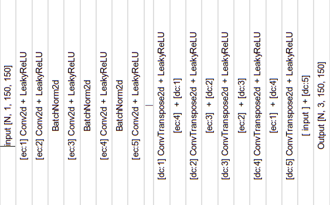

a simple CNN Autoencoder for colorizing gray scale images. Ofcourse these are not great results but built by own interest of autoencoders.

### Data set
I used [Landscape color and grayscale images](https://www.kaggle.com/theblackmamba31/landscape-image-colorization) from kaggle website for training network.

### Model Architecture
the intial goal here is to build simple network becuase we can achive much better results with Transfer Learning. so after couple of trails, I stayed at this. And used concatinating oparation with encoding results and decoder inputs to help model to converge faster.

| ------------------------- Encoder -------------------------------------------------- Decoder ------------------------- |
|:---:|

### Evaluaiton
* Divided total 7129 images into train-images 5703( ~ 80%), 20% validation-images 1426 (~ 20%)
* Tried L2, but L1 Loss much stabilized this time.

### Usage

        >> python app.py data/sample-images/forest.jpg

### Acknowledgments
* Pytorch [docs](https://pytorch.org/docs/stable/index.html)
* Landscape color and grayscale images [data set](https://www.kaggle.com/theblackmamba31/landscape-image-colorization)